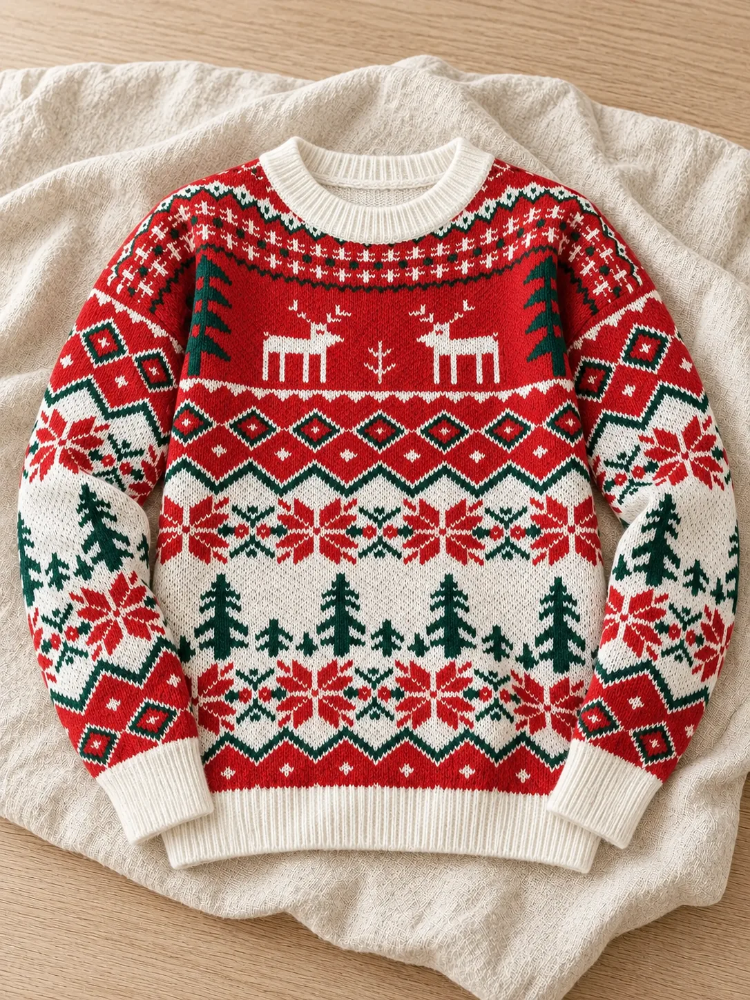

# Kalėdiniai drabužiai — aktyvūs katalogo produktai

**Dydžiai ir pasirinkti spalvų / raštų variantai sutikrinti pagal vartotojo pateiktas AliExpress ekrano nuotraukas.** Parduotuvės kainos: JK-057 €17,99, JK-058 €19,99, JK-059 €18,99, JK-060 €19,99. Šios kainos naudojamos aktyviuose katalogo produktuose pagal pasirinktą pasiūlymą. Tiekėjo puslapio kaina taikoma vienam pasirinktam drabužiui, todėl šeimos ir poros deriniams kiekviena dalis tiekėjo puslapyje gali būti užsakoma atskirai. Audinio sudėtis ir kiekvieno dydžio tikslūs išmatavimai nepateikti; AliExpress AI apžvalga nelaikoma patvirtinta gaminio specifikacija. Nieko nedeployinta.

**Savikainos pastaba:** pagal ekrano nuotraukose matomus pasirinktus variantus (prekė + tiekėjo pristatymas) gaunasi JK-057 €35,79, JK-058 €20,61, JK-059 €26,16 ir JK-060 €19,06. Todėl €15–20 pardavimo kainos techniškai teisingai perduodamos į checkout, bet nepadengia visų tiekėjo kaštų JK-057 ir JK-059, o JK-058 bei JK-060 palieka labai mažą arba neegzistuojančią maržą prieš mokėjimo, grąžinimo ir aptarnavimo kaštus.

Vaizdai optimizuoti į WebP (47–456 KiB). JK-057 ir JK-058 pagrindiniai vaizdai sugeneruoti pagal tikros prekės nuotraukas; JK-059 ir JK-060 pagrindiniai vaizdai paimti iš tiekėjo nuotraukų. Sugeneruoti vaizdai yra iliustracijos, todėl jų rašto detalės gali nežymiai skirtis. Naudotas integruotas `imagegen` įrankis: kiekviename prašyme buvo nurodyta išlaikyti konkretaus AliExpress gaminio spalvas ir raštą bei pritaikyti šiltą kreminį, medžio ir natūralios šviesos parduotuvės fotografijos stilių. Sukurta moteriško megztinio išdėstymo nuotrauka, dvi trijų asmenų šeimos scenos ir poros scena; pastaroji neįtraukta į galeriją, nes audinio vaizdas per daug skyrėsi nuo tiekėjo nuotraukos.

## JK-057 — Kalėdinis megztinis „Šventinis raštas“

- Slug: `kaledinis-megztinis-sventinis-rastas`
- Tiekėjo prekė: https://www.aliexpress.com/item/1005010074119128.html
- Kam: moteriai; dydis parenkamas atskirai.
- Tiekėjo pasirinkto varianto kaina ekrano nuotraukoje: 12,39 €; pristatymas 23,40 €.
- Spalvos variantas: Red.
- Dydžiai: S (EU 36), M (EU 38), L (EU 40/42).
- Parduotuvės kaina: 17,99 €.
- Antraštė: Raudonas kalėdinis megztinis su eglutėmis ir elniais.

Raudonos, baltos ir žalios spalvų šventinis raštas su eglutėmis bei elniais — ryškus pasirinkimas kalėdiniam vakarui ar žiemos nuotraukoms.

Moteriškam modeliui galima rinktis S (EU 36), M (EU 38) arba L (EU 40/42) dydį.

## JK-058 — Šeimos kalėdiniai megztiniai „Kalėdų džiaugsmas“

- Slug: `seimos-megztiniai-kaledu-dziaugsmas`
- Tiekėjo prekė: https://www.aliexpress.com/item/1005013181918869.html
- Kam: vaikui, moteriai ir vyrui; kiekvienam reikalingas atskiras dydis.
- Tiekėjo pasirinkto 3Y varianto kaina: 14,49 €; pristatymas 6,12 €. Kitų dydžių kainos gali skirtis.
- Spalvos variantas: Red.
- Vaikui: 3Y, 4Y, 5Y, 6Y, 7Y.
- Moteriai ir vyrui: S, M, L, XL, 2XL, 3XL.
- Parduotuvės kaina už pasirinktą šeimos derinį: 19,99 €.
- Antraštė: Derantys raudoni Kalėdų Senelio ir snaigių motyvai šeimai.

Raudonas šventinis dizainas su Kalėdų Senelio ir snaigių motyvais skirtas derančiam vaiko, moters ir vyro įvaizdžiui.

Vaikui galima rinktis 3Y–7Y, o moteriai ir vyrui — S–3XL. Kiekvieno šeimos nario dydis pasirenkamas atskirai.

## JK-059 — Kalėdiniai megztiniai „Sniego duetas“

- Slug: `kalediniai-megztiniai-sniego-duetas`
- Tiekėjo prekė: https://www.aliexpress.com/item/1005012560695508.html
- Kam: moteriai ir vyrui; kiekvienam reikalingas atskiras dydis.
- Tiekėjo pasirinkto XXL varianto kaina: 15,39 €; pristatymas 10,77 €.
- Pasirinktas dizainas: SB102-142 (raudonas / žalias sniego senis). Ekrano nuotraukoje matomi dar du dizainai, tačiau jų kodai neparodyti ir jie neįtraukti į šią prekę.
- Abiem žmonėms: M (EU 38), L (EU 40/42), XL (EU 44), XXL (EU 46).
- Parduotuvės kaina už pasirinktą poros derinį: 18,99 €.
- Antraštė: Raudonų, žalių ir baltų spalvų sniego senio motyvas porai.

Didelis sniego senio motyvas ir raudonos, žalios bei baltos spalvos kuria linksmą derinį dviem žmonėms.

Moters ir vyro dydžiai pasirenkami atskirai: M (EU 38), L (EU 40/42), XL (EU 44) arba XXL (EU 46).

## JK-060 — Šeimos kalėdiniai megztiniai „Šiaurės raštas“

- Slug: `seimos-megztiniai-siaures-rastas`
- Tiekėjo prekė: https://www.aliexpress.com/item/1005010102733468.html
- Kam: vaikui, moteriai ir vyrui; kiekvienam reikalingas atskiras dydis.
- Tiekėjo pasirinkto Kids 4-5Y varianto kaina: 13,89 €; pristatymas 5,17 €. Suaugusiųjų kainos gali skirtis.
- Spalvos variantas: Red.
- Vaikui: Kids 4-5Y, Kids 6Y, Kids 7-8Y, Kids 9-10Y, Kids 11-12Y.
- Moteriai: Mom S, Mom M, Mom L, Mom XL, Mom 2XL.
- Vyrui: Dad S, Dad M, Dad L, Dad XL, Dad 2XL.
- Parduotuvės kaina už pasirinktą šeimos derinį: 19,99 €.
- Antraštė: Raudonas ir baltas šiaurietiškas elnių bei snaigių raštas šeimai.

Raudonų ir baltų spalvų šiaurietiškas raštas su elniais bei snaigėmis skirtas šventiniam vaiko, moters ir vyro deriniui.

Kiekvienam šeimos nariui dydis pasirenkamas atskirai: vaikui 4–12 metų variantai, moteriai Mom S–2XL, vyrui Dad S–2XL.
